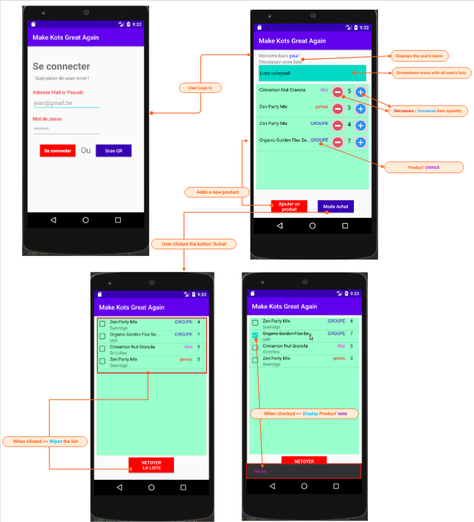

# Mobile Application

Target audience | IDE | Language
---------|----------|---------
 **`Android`** users | Android studio | Java

---

### Release

* Version ***1.0*** : [Make-kots-great-again_v1.apk](https://github.com/make-kots-great-again/mobile/blob/master/release/make-kots-great-again_v1.apk)
* Version ***2.0*** : [Make-kots-great-again_v2.apk](https://github.com/make-kots-great-again/mobile/blob/master/release/make-kots-great-again_v2.apk)
* Version ***Final*** : [Make-kots-great-again.apk](https://github.com/make-kots-great-again/mobile/blob/master/release/make-kots-great-again.apk)

---

### Mocup

Link to Mocup (read only) => https://app.moqups.com/srj025RSEb/view/page/ae8fe8eb0



---

### Lint

We used gradle' lint to check errors and warnings in our code.

In order to do that, we need to add a few lines in the "**`build.gadle`**" :

```gradle
android {
    ...

    lintOptions {
        abortOnError false
    }
    ...
}
```

Then, to execute the task :

```bash
./gradlew lint
```

---

### API Request used

[API Documentation](https://make-kots-great-again.github.io/web/ "api doc")

[Java class/file with all API request](https://github.com/make-kots-great-again/mobile/blob/master/makekotsgreatagain/app/src/main/java/com/morgan/make_kots_great_again/ApiRequest.java)

1. ***login_post_request()***
    * Used to log in the user
    * **`https://kotsapp.herokuapp.com/server/api/login`**

2. ***Get_Shopping_Lists()***
    * Used to fetch the current user' shopping lists
    * **`https://kotsapp.herokuapp.com/server/api/shoppingList/`**

3. ***Get_Shopping_Lists_items()***
    * Used to fetch the products from the currently choosen shopping list
    * **`https://kotsapp.herokuapp.com/server/api/shoppingList/`**

4. ***Get_items_page3()***
    * Same as above, except that it's used to build page 3
    * **`https://kotsapp.herokuapp.com/server/api/shoppingList/`**

5. ***getProductsFromPattern()***
    * Used to fetch all products starting with the given 3 letters
    * **`https://kotsapp.herokuapp.com/server/api/products/`**

6. ***addProductToList()***
    * Used to **add** a specified product to the currently choosen list
    * **`https://kotsapp.herokuapp.com/server/api/shoppingList/addProduct/`**

7. ***deleteProductRequest()***
    * Used to **remove** a specified product to the currently choosen list
    * **`https://kotsapp.herokuapp.com/server/api/shoppingList/removeProduct/`**

8. ***updateProductRequest()***
    * sed to update all products that have been modified before going to page 3
    * **`https://kotsapp.herokuapp.com/server/api/shoppingList/updateQuantity/`**