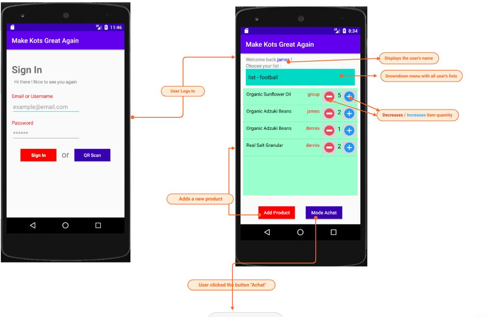
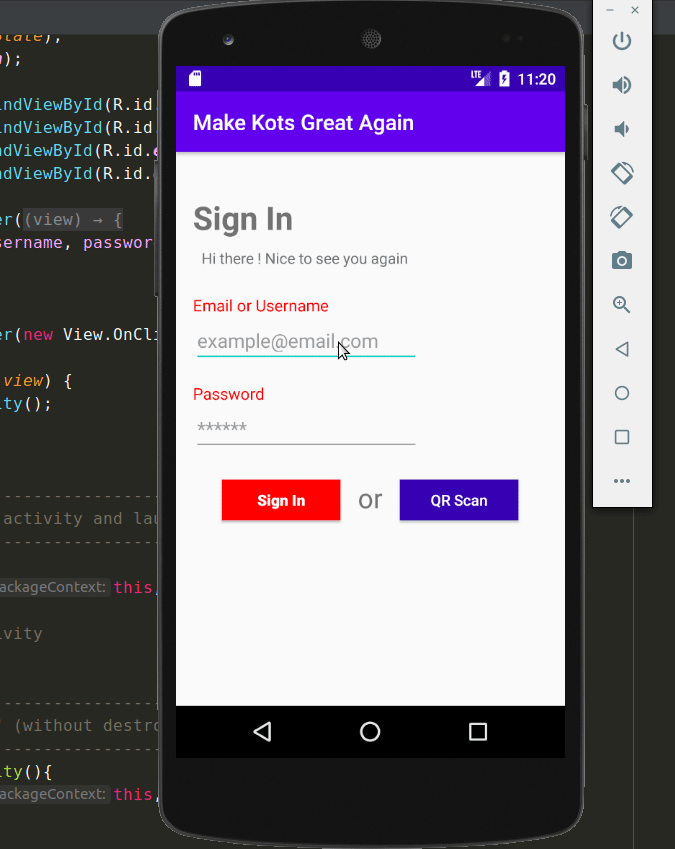
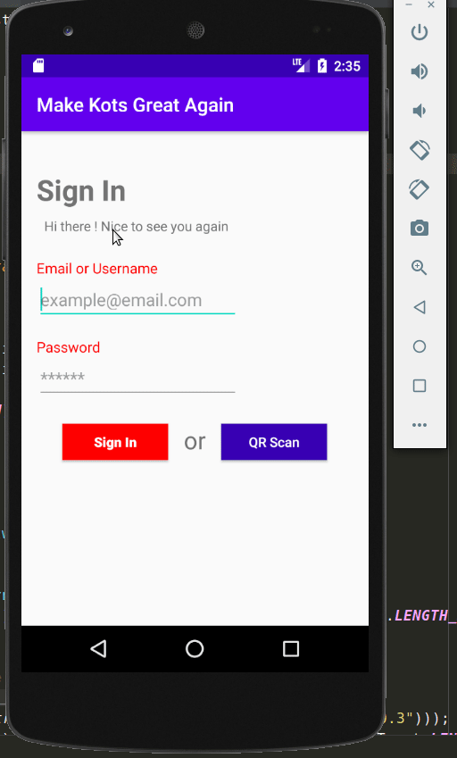
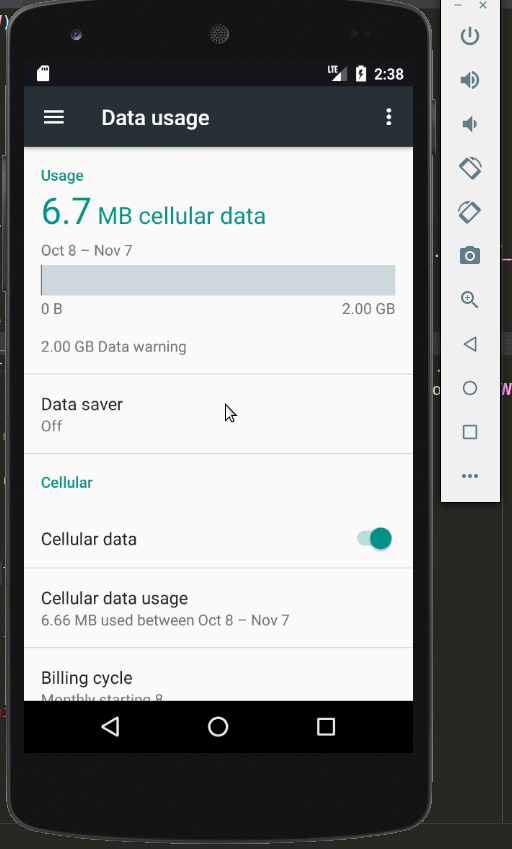

# Mobile Application

Target audience | IDE | Language
---------|----------|---------
 **`Android`** users | Android studio | Java

---

### Release

* Version ***1.0*** : [Make-kots-great-again.apk](https://github.com/make-kots-great-again/mobile/blob/master/release/make-kots-great-again.apk)

---

### Mocup

Link to Mocup (read only) => https://app.moqups.com/srj025RSEb/view/page/ae8fe8eb0

---

### Demo

1. Connexion via username et mot de passe

2. Connexion via code QR

---

### Tests

#### Test n°1

Checks if the user has entered a correct username and password combination (method "login_post_request").
> I want to show the error message if the username and/or password are incorrect.

#### Test n°2

1. Checks if the user is connected to internet (method "isConnectedToInternet").
> I disable the internet connection in order to show the corresponding error message.

2. Checks if the api is reachable (method "isHostUp").
> I entered a fake ip adress in the code to show the corresponding error message.

