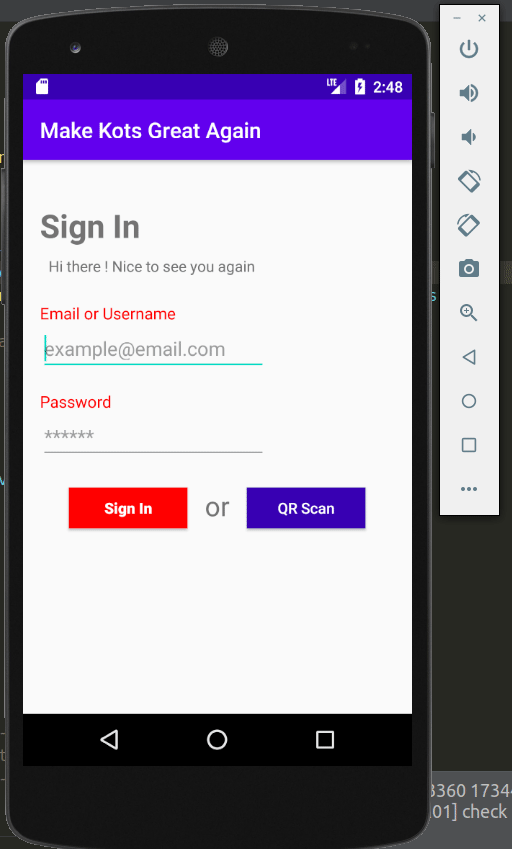

# Mobile Application

Target audience | IDE | Language
---------|----------|---------
 **`Android`** users | Android studio | Java

---

### Mocup

Link to Mocup (read only) => https://app.moqups.com/srj025RSEb/view/page/ae8fe8eb0

---

### Demo

---

### Tests

#### Test n°1

Checks if the user has entered a correct username and password combination (method "login_post_request").

#### Test n°2

1. Checks if the user is connected to internet (method "isConnectedToInternet").
2. Checks if the api is reachable (method "isHostUp").

